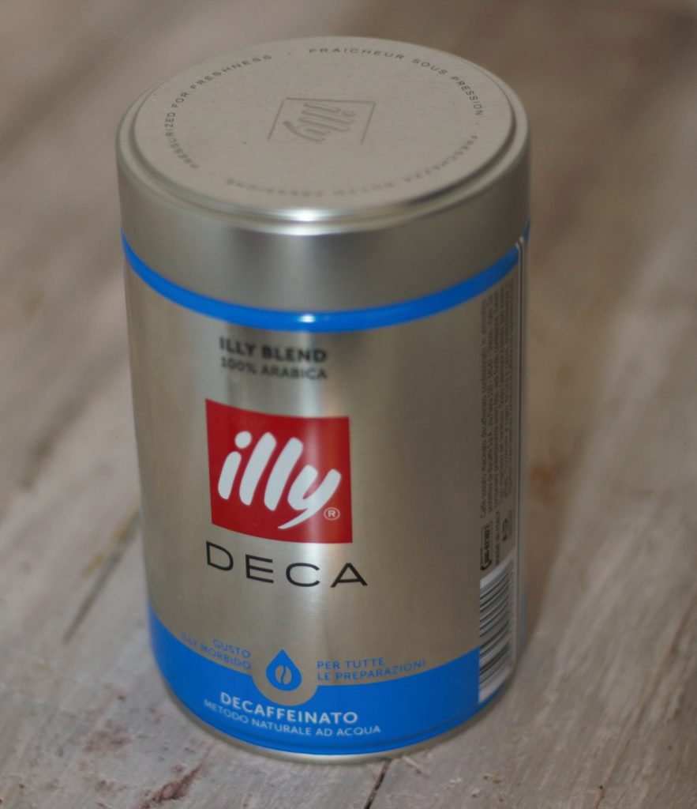
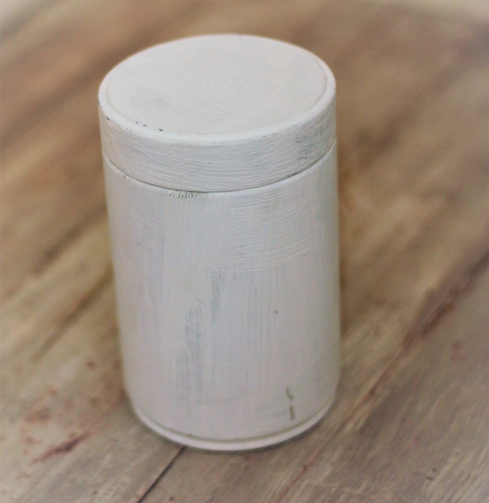
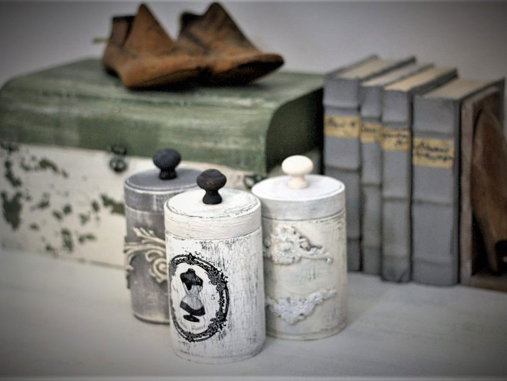

## Tutto quello che si può riutilizzare non si deve buttare.

Oggi vedremo come riutilizzare i barattoli di caffè. In rete si possono trovare vari modi di riciclo, io condivido con voi il mio. Vi chiederete come si potrebbe fare, niente di più semplice. Con un po' di pazienza, fantasia e tanto divertimento tutto è possibile!

### Cosa serve?

- vernice chalk paint
- pennelli
- decorazioni a scelta (transfer di immagine, fregi di pasta di legno)
- pomelli

### Come procedere?

Il primo step è quello di sgrassare bene il barattolo, e poi preparare un piano di lavoro dove iniziare a verniciare.

E anche in questo caso ho usato il mio primer, visto che nel tempo mi sono resa conto che sia il giusto prodotto.

Dopo il primer  si deve aspettare il tempo che il barattolo si asciughi. In base a ciò che vi piace, decidete poi come applicare il colore: o una tinta unica oppure due di contrasto.

Se avete deciso di aggiungere dei fregi, il colore dovrà attendere. Solo dopo aver incollato le vostre decorazioni, potrete dare la prima mano di vernice. Se invece volete fare il trasferimento di immagine, dovrete aspettare proprio alla fine, quando il colore è asciutto. Come fregi potrete anche crearle da soli. Mi sono trovata molto bene con i stampi di Iod, vi lascio il link: <a href="https://www.amazon.it/Prima-Marketing-Vintage-Moulds-Large-Fleurish/dp/B01LZAIY09/ref=sr_1_4?__mk_it_IT=%C3%85M%C3%85%C5%BD%C3%95%C3%91&keywords=iod&qid=1575289163&s=kitchen&sr=1-4" target="_blank">clicca qui</a>.

Per migliorare l'aspetto del vostro barattolo e renderne più pratico l'utilizzo, potete aggiungere un pomello. Questo va incollato oppure assicurato al coperchio del barattolo con un foro per avere una maggiore tenuta.

Se qualche barattolo in particolare vi piace, posso fare un tutorial più avanti.

Buon divertimento!