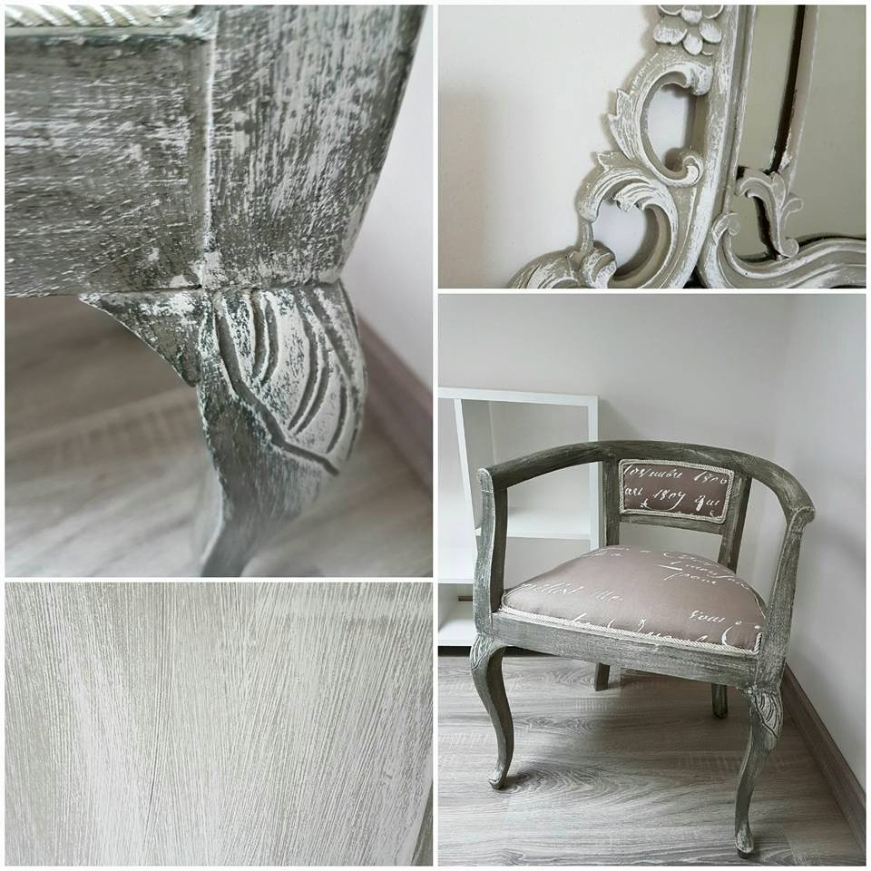

## Il mio primo approccio al mondo shabby è stato molto casalingo.

In parte perché i costi sono una parte importante del prezzo finale, in parte anche perché la soddisfazione di fare da sola i miei colori è stata gratificante. Ho fatto tanta ricerca sul web, dove ho trovato varie ricette, e ovviamente ho fatto diversi tentativi, sbagliando non solo con le quantità, ma anche nella scelta degli ingredienti. I miei primi lavori sono stati fatti usando la chalk paint fai da te, e posso dire che sono stata soddisfatta del risultato.

Qui sotto vi lascio la mia ricetta, o meglio il mio risultato migliore:

- 4 parti di idropittura o smalto all'acqua (idropittura per i muri -- io la preferisco)
- 1 parte di gesso di bologna (si trova in qualsiasi colorificio)
- acqua q.b.

Mescolate in un vaso il gesso con poca acqua usando un mestolo, in modo che non si formino grumi. Dopo aggiungete lo smalto e poco alla volta dell'acqua fino a quando non avrete una miscela dalla consistenza simile allo yogurt.

A questo punto siete pronti per iniziare a dare sfogo alla vostra creatività a basso costo. Per dare colore alla vernice, usate dei pigmenti, che sia in polvere che liquidi andranno benissimo. A questo punto, il mio consiglio è di aggiungerli un po' alla volta per non  rischiare di avere una vernice troppo scura.

Detto ciò, sono la prima a dare giusto peso anche ai vari prodotti che si trovano in commercio. La particolarità di queste è che alcune contengono delle finiture che permettono di ottenere un risultato simile con meno step lavorativi.

Condivido con voi alcuni dei miei primi lavori, dove la mia versione di chalk paint ha fatto il suo dovere! La soddisfazione più grande viene sempre a lavoro finito, quando riesco a vedere l'insieme e le mie sfumature prendono vita. Ma anche quando ho realizzato che posso modificare i colori dei miei arredi, che posso dare sempre un altro aspetto alla casae creare degli spazi nuovi!

Con questa ricetta di solito preparo il primer che utilizzo nei miei lavori.