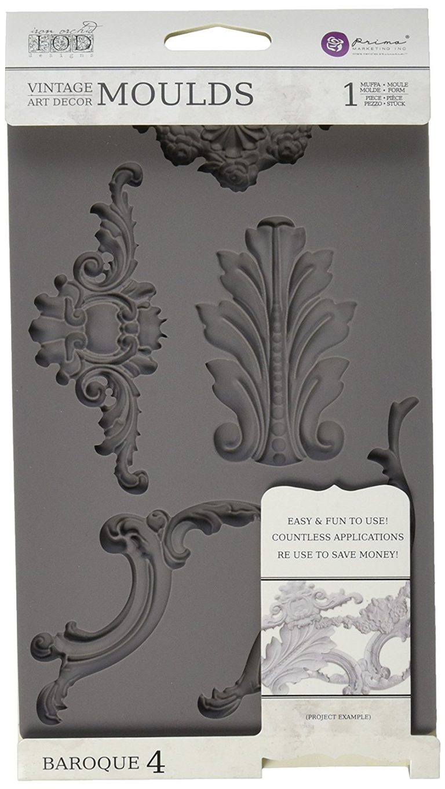
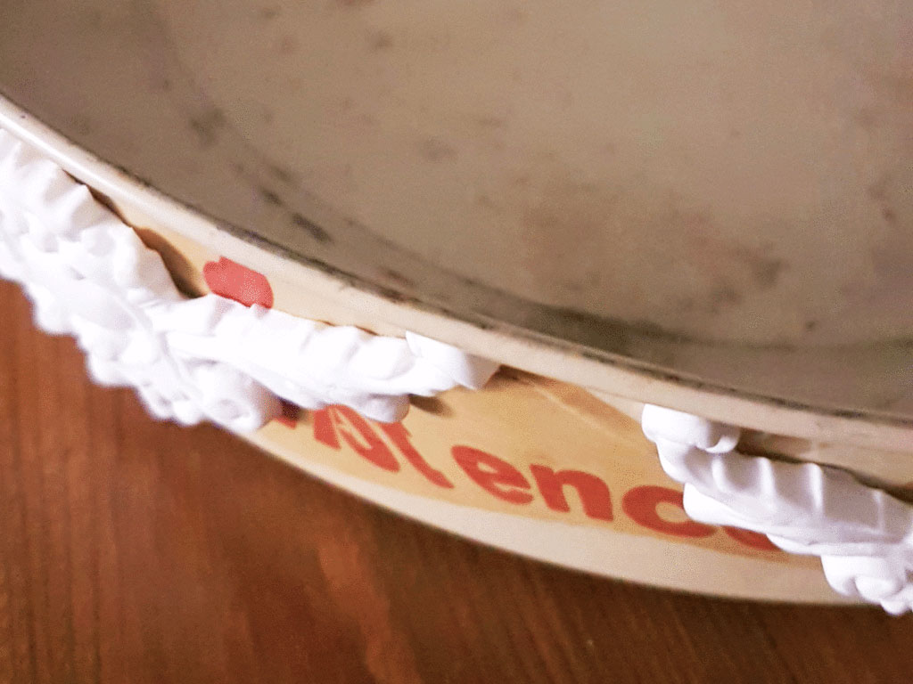
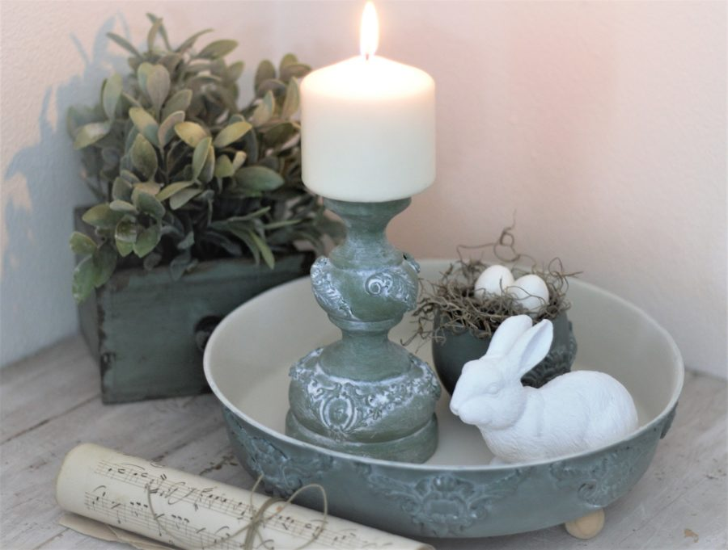

## La parola chiave: ricreare

Quando trasformare diventa il sinonimo di riutilizzare, tutto è possibile. Non era più utilizzabile in cucina, ma sicuramente poteva avere un altro scopo. Quindi ho deciso di dargli una nuova forma.

Siccome i vassoi non sono mai abbastanza, l'idea non è tardata ad arrivare. Ho pensato di decorare la teglia con i miei famosi fregi, famosi perché li adoro. Solitamente lavoro queste decorazioni con la pasta di legno,  ma in questo caso è sufficiente la pasta di carta. Semplicemente perchè la mia teglia diventerà un oggetto decorativo.

Ho utilizzato gli stessi stampi anche per trasformare i barattoli di caffè. Vi parlavo di questi nell'articolo [Come riutilizzare i barattoli di caffè.](/come-riutilizzare-i-barattoli-di-caffe/)

Dopo aver sgrassato bene la teglia si possono incollare i fregi. È importante che siano abbastanza freschi per poter seguire la forma curva della teglia. Il tempo necessario per asciugare il tutto varia in base a quanto materiale viene utilizzato per riempire gli stampi. Per incollarli ho usato la colla vinilica, solo quando si usa la pasta di legno si puo incollare anche con la colla a caldo (ma solo quando lo stampo è ben asciutto).

Infine ho dato una mano di primer, coprendo tutta la superficie.

Come colore di base ho scelto il "grandma green" della To-do Fleur,  perché mi dà una sensazione di primavera, di fresco.

Per finire la trasformazione è arrivato il momento delle sfumature. Mi piacciono tanto, che siano fatte con la cera o con un colore di contrasto, vanno bene lo stesso per me. In questo caso ho utilizzato un po' di bianco titanio con il clear glaze della *Fusion*. Un prodotto che ho scoperto da poco, ma che mi dà tanta soddisfazione. Si possono creare delle "cere" per tutti i gusti. Basta solo mescolare il colore che si desidera con il glaze ed il gioco è fatto.

Vi parlo di tutti questi prodotti che io ho iniziato ad utilizzare solo ultimamente, ma che mi fanno scoprire delle nuove possibilità.

La cosa più difficile è decidere dove collocare il nuovo oggetto creato. In questo caso, avendo finito il tutto nei giorni prima di Pasqua, la scelta è diventata più facile.

Buon divertimento e spero che anche voi diate sfogo alla vostra creatività!